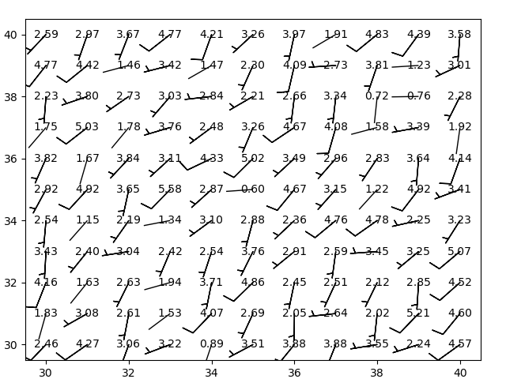
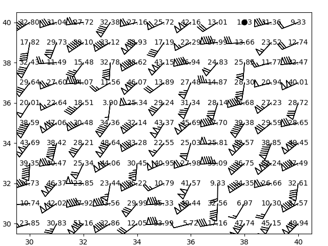
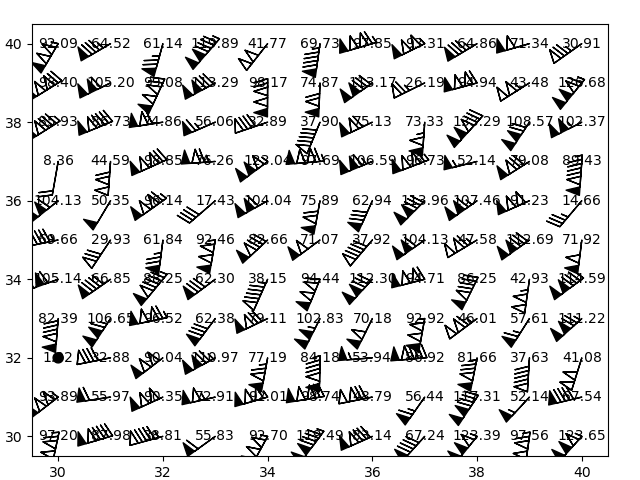

# 基于matplotlib的一些扩展

## 绘制2m以下的风
matplotlib_extend.change_barb_of_draw_below_2m() 

## 绘制空心旗子
matplotlib_extend.change_barb_of_draw_empty_flag()

## 绘制实心+空心旗子
matplotlib_extend.change_barb_of_draw_two_flag()
